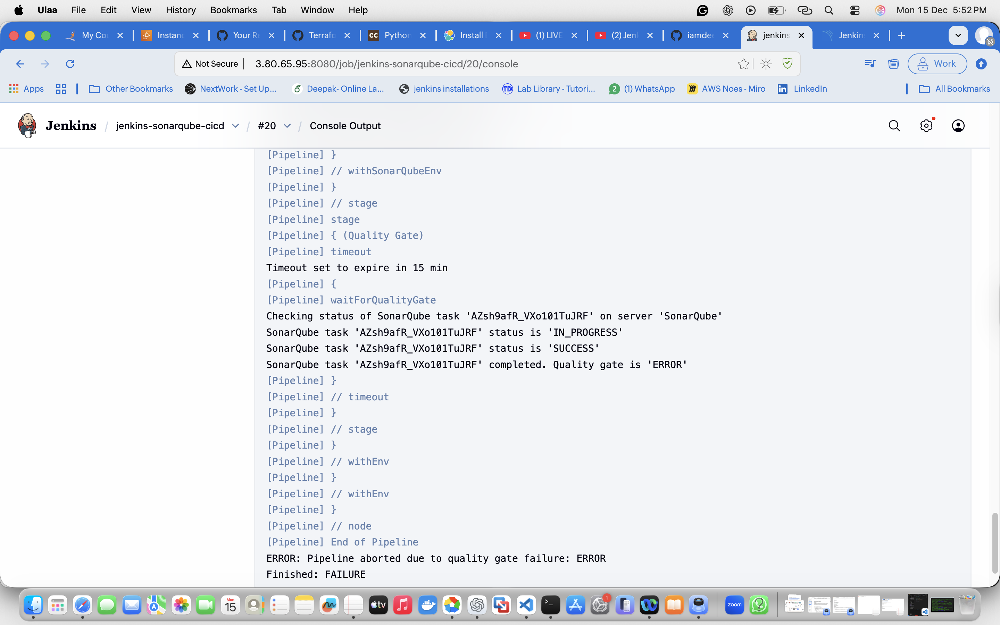
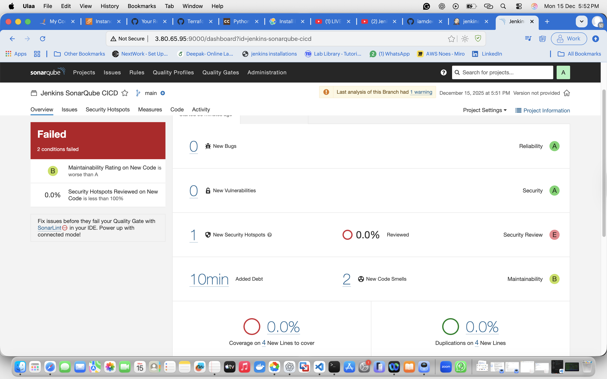
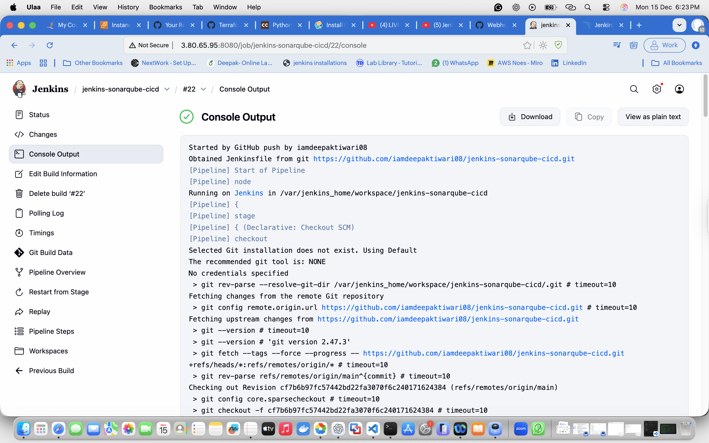
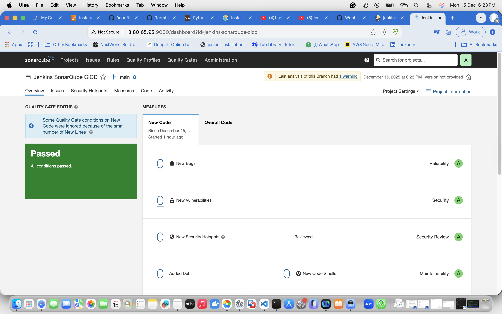
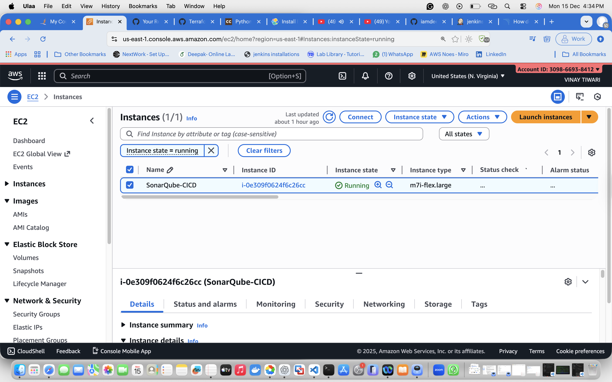

🙏 Hanuman Kripa ❤️

# Jenkins – SonarQube CI/CD Pipeline

This project demonstrates an **end-to-end CI/CD pipeline** using **GitHub, Jenkins, SonarQube, and AWS EC2**.  
Every code push automatically triggers Jenkins, runs SonarQube analysis, and enforces **Quality Gates**.

---

## 🛠️ Tools Used
- **GitHub** – Source code management
- **Jenkins** – CI/CD pipeline automation
- **SonarQube** – Code quality & security analysis
- **AWS EC2** – Hosting Jenkins & SonarQube
- **Python** – Sample application code

---

## 🔁 CI/CD Flow
1. Developer pushes code to GitHub  
2. GitHub webhook triggers Jenkins pipeline  
3. Jenkins runs SonarQube analysis  
4. Quality Gate decides **FAIL / PASS**  
5. Pipeline stops or continues based on Quality Gate

---

## ❌ Phase 1: Quality Gate Failure

When insecure / bad-quality code was pushed, SonarQube failed the Quality Gate and Jenkins aborted the pipeline.

### Jenkins Pipeline – Failed

### SonarQube – Failed Quality Gate

---

## ✅ Phase 2: Quality Gate Passed

After fixing the code issues, the pipeline was triggered again and passed successfully.

### Jenkins Pipeline – Success

### SonarQube – Passed Quality Gate

---

## ☁️ Infrastructure (AWS EC2)

Jenkins and SonarQube are running on an AWS EC2 instance.

---

## 🎯 Key Highlights
- GitHub webhook based pipeline triggering
- SonarQube Quality Gate enforcement
- Jenkins pipeline automatically fails on bad code
- Real-world DevOps workflow on AWS

---

## 📌 Conclusion
This project demonstrates how **code quality is enforced automatically** in a CI/CD pipeline using Jenkins and SonarQube before code moves forward in the delivery process.
